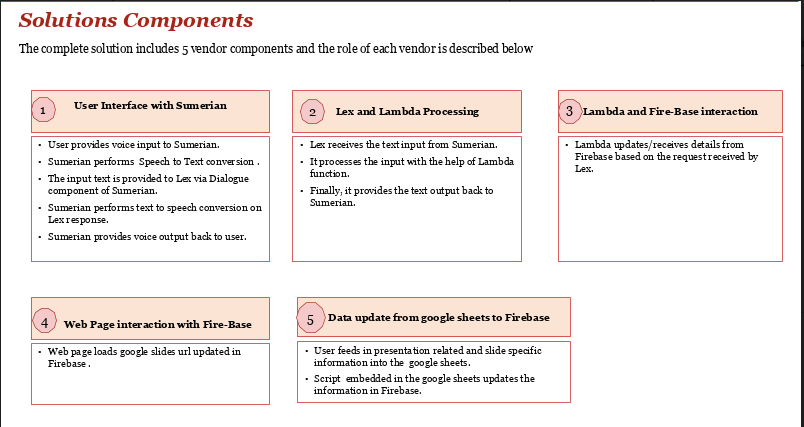

# Introduction
Every new business relation needs a round of communications. Communication is made more effective with the use of visual tools, and specifically, presentations. Professing information from a presentation involves conveying relevant data and answering questions related to it. A new frontier in technology explores these features of communication by building a virtual director, that integrates augmented reality tools, and virtually demonstrates a presentation. 
  ## _Maya - The Digital Director_
The individual developed to virtually demonstrate a presentation is named Maya. Maya serves as the Digital Director, responsible for the following functionalities:
* Reading from the current slide
* Changing the slides chronologically
* Jumping to a specific slide as requested by the user
* Reading specific information from a slide

# Technology Used
The following technology tools and platforms are used to implement the Digital Director:
* AWS Sumerian
* Amazon Lex
* Lambda Processing
* Fire-Base
* HTML

Here are a few highlights of the specific functionalities implemented by the above.

  ### _AWS Sumerian_
  AWS Sumerian is the augmented reality platform presented by Amazon. The required components or 'assets', such as furniture, light, etc. are integrated into a particular scene. The development platform also provides provision to customize the qualities of these components, such as the angular orientation of the objects or the brightness of the lights. 
  ### _Amazon Lex_
  Amazon Lex provides the semantic tools for the effective functionalities of the Digital Director. It is used for building a conversational interface using voice and text. 
  ### _Lambda Processing_
  ### _Fire-Base_
  ### _HTML components_ 

# Architecture

 
 # How To Use It

 # Who Will Use It
Business professionals who wish to make important meetings and interactions an automated experience are the foremost users of the Digital Director. 
